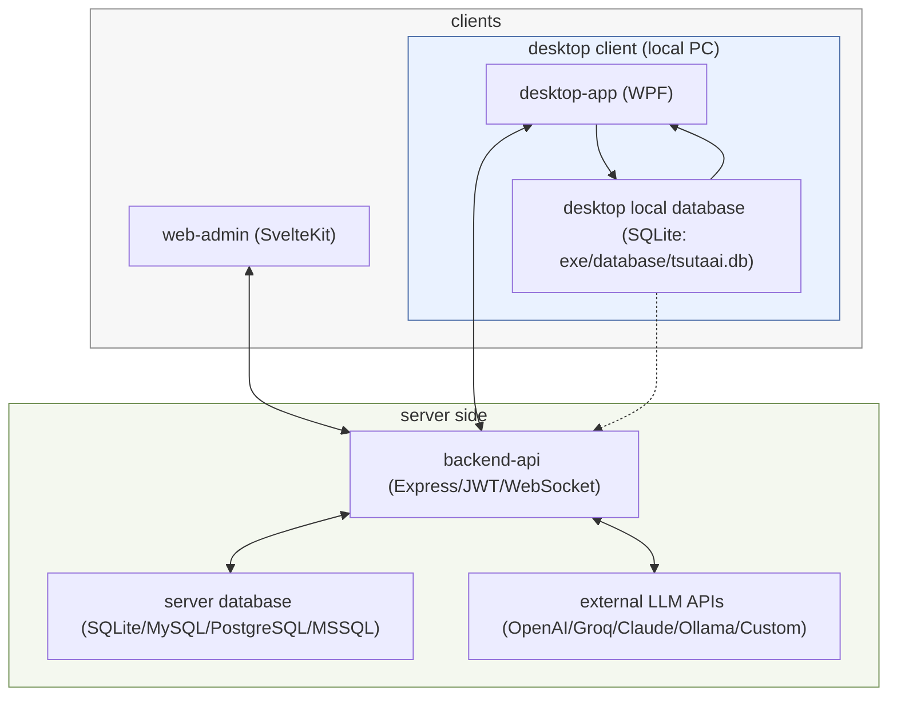

# TsutaAI システム紹介ドキュメント

> この README は「ツタAIシステムを初めて触る人」に向けた、実装ベースの総合ガイドです。  

> はじめて起動する場合は、先に **[QUICKSTART.md](./QUICKSTART.md)** を確認してください。  

---

## 0. この README の目的

この README は次の目的で作成されています。

- ツタAIシステム全体像を短時間で理解する
- `backend-api` / `web-admin` / `desktop-app` の役割分担を理解する
- 実際に動かすための手順を迷わず実行できる
- 実装済み機能と未完了機能（TODO/未整備）を区別して把握できる
- 現在の進捗（おおよそ 80%）を、テスト・コード・運用観点で説明する

この README の情報源は以下です。

- `src/backend-api/src/**`
- `src/web-admin/src/**`
- `src/desktop-app/TsutaAI/**`
- `src/backend-api/scripts/init-database.js`
- `package.json`（`src/` / `src/backend-api/` / `src/web-admin/`）

---

## 1. システム全体像

TsutaAI は、プロジェクト管理と日々の作業実績を、AI分析と組み合わせて扱う統合システムです。

構成は次の 3 コンポーネントです（いずれも `src/` 配下）。

- `backend-api/`:
  Node.js + Express の API サーバー
- `web-admin/`:
  SvelteKit 管理画面
- `desktop-app/`:
  C# WPF デスクトップアプリ（Windows）

加えて、共有データは `src/database/` 配下の DB ファイル/SQL を利用します。

---

## 2. アーキテクチャ（概要）



---

## 3. 各コンポーネントの役割

### 3.1 backend-api の役割

`backend-api` は業務ロジックの中心です。

- APIエンドポイント提供（`/api/*`）
- JWT認証と権限制御（admin/manager/member）
- プロジェクト、タスク、見積もり、スプリント、休暇、メンタルヘルス等の業務処理
- AI連携（WBS生成、リスケジュール提案、自動割当、日報支援など）
- WebSocket サーバー（`/ws`）によるリアルタイム通知
- Swagger UI (`/api-docs`) と OpenAPI JSON (`/openapi.json`) の配信

### 3.2 web-admin の役割

`web-admin` は管理者・リーダー向けのブラウザUIです。

- 進捗、アラート、分析結果の可視化
- プロジェクト管理（作成、編集、メンバー管理、WBS）
- 見積もり、スプリント、レポート生成
- チーム運用（メンバー、休暇、メンタルヘルス、ヘルプリクエスト）
- システム設定（LLM設定、DB初期化操作など）

### 3.3 desktop-app の役割

`desktop-app` は現場メンバー向けの常駐・記録系クライアントです。

- 今日のタスク確認
- 作業ログ・日報入力
- タスクコメント/添付操作
- 活動監視（キーボード、マウス、アクティブウィンドウ）
- 1時間単位サマリー送信
- ヘルプリクエスト、メンタルヘルス入力
- 通知受信（WebSocket）

---

## 4. リポジトリ構成（主要）

```text
TsutaAI/
├── src/
│   ├── backend-api/          # APIサーバー
│   ├── web-admin/            # 管理Web UI
│   ├── desktop-app/          # WPFクライアント
│   ├── database/             # DBファイルとSQL
│   └── docker-compose.yml
└── README.md
```

---

## 5. 実装規模（コード確認ベース）

この項目は 2026-02-15 時点で、実ファイルを数えて記載しています。

- backend-api
  - `src` 配下 JS ファイル: 118
  - ルートファイル: 30
  - コントローラ: 27
  - サービス: 44
  - ルート定義数（`router.get/post/put/patch/delete`）: 235
- web-admin
  - 画面ページ（`+page.svelte`）: 27
  - コンポーネント（`src/lib/components/**/*.svelte`）: 62
  - ストア（`src/lib/stores`）: 10
  - APIクライアント (`src/lib/api/client.ts`): 1241 行
- desktop-app
  - C# ソース: 94
  - 画面 (`Windows/*.xaml`): 27
  - サービス: 18
  - モデル: 30

---

## 6. backend-api の詳しい説明

### 6.1 技術スタック

- Node.js
- Express 5
- JWT (`jsonwebtoken`)
- DBアクセス
  - `knex`
  - `better-sqlite3`
  - `mysql2`
  - `pg`
  - `tedious`
- セキュリティ
  - `helmet`
  - `express-rate-limit`
- API ドキュメント
  - `swagger-ui-express`
  - `openapi.yaml`
- リアルタイム
  - `ws`

### 6.2 サーバー起動時の流れ

`backend-api/src/app.js` の流れは概ね以下です。

1. 設定ロード（`settingsService.loadSettings()`）
2. HTTPS / HTTP サーバー生成
3. セキュリティ設定（HTTPS強制、HSTS、ヘッダー）
4. グローバルレート制限適用
5. JSONパーサ・リクエストログ
6. `/health` マウント
7. Swagger UI と OpenAPI JSON 配信
8. `/api/*` ルート群マウント
9. エラーハンドラ
10. WebSocket 初期化（`/ws`）
11. 待ち受け開始

### 6.3 認証・権限

- 認証
  - `authenticateToken`（Bearer JWT）
- 権限
  - `authorize('admin')`
  - `authorizeManager`（admin または manager）
  - `authorizeSelfOrAdmin`

### 6.4 セキュリティ対策

- Helmet によるセキュリティヘッダー
- HSTS（HTTPS時）
- 本番環境での HTTPS リダイレクト
- ログイン/API/AI/アップロード/グローバルのレート制限
- `trust proxy` 設定（リバースプロキシ前提）

### 6.5 API仕様書

- Swagger UI: `/api-docs`
- OpenAPI JSON: `/openapi.json`
- OpenAPI YAML 本体: `backend-api/openapi.yaml`

注意点:

- `openapi.yaml` は存在しますが、実装エンドポイント総数（235）に対して記載が追いついていない箇所があります。
- 仕様確認は Swagger/OpenAPI だけでなく、ルート実装も併読してください。

### 6.6 WebSocket

- エンドポイント: `/ws`
- 認証メッセージ: `type: "auth"` + `token` または `userId`
- サーバー送信イベント:
  - `project_update`
  - `task_update`
  - `worklog_created`
  - `ai_alert`
  - `auth_success`
  - `pong`
  - `error`

### 6.7 データベース

バックエンドは Knex を中心に DB を扱います。

- SQLite（`better-sqlite3`）をデフォルト利用
- MySQL / PostgreSQL / MSSQL も設定可能
- `knexfile.js` で接続を切り替え

### 6.8 `init-database.js` の役割

`backend-api/scripts/init-database.js` は初期化専用の大型スクリプトです（2360行）。

主な処理:

1. 既存SQLite DBのバックアップ
2. LLM設定値の退避
3. DBファイル削除（SQLite）
4. マイグレーション実行
5. `database/seed.sql` 実行
6. 追加サンプルデータ生成
7. 統計とサンプルログイン情報出力

出力される既定ログイン情報（開発用）:

- ユーザー名: `admin`
- パスワード: `demo_password`

---

## 7. web-admin の詳しい説明

### 7.1 技術スタック

- SvelteKit 2
- Svelte 5
- TypeScript
- Vite
- Bootstrap / Bootstrap Icons

### 7.2 実行モード

- `ssr = false`, `csr = true`
- SPA運用（`adapter-static` + `fallback: index.html`）

### 7.3 画面の性格

`web-admin` は管理系画面として以下に強いです。

- 全体ダッシュボード
- 複数プロジェクト横断分析
- WBS編集とAI支援
- 見積もり、スプリント、レポート
- チームコンディション管理

### 7.4 ナビゲーションカテゴリ

実装されているカテゴリ:

- 概要・分析
  - ダッシュボード
  - レポート出力
  - AIアラート
- プロジェクト管理
  - プロジェクト一覧
  - 見積もり
  - スプリント管理
  - プロジェクト健全性
- 進捗・タスク管理
  - 進捗トラッキング
  - 日報一覧
  - 作業報告
  - 1時間ごとの活動
- チーム管理
  - メンバー
  - 休暇管理
  - メンタルヘルス
  - ヘルプリクエスト
- システム
  - 設定

### 7.5 APIクライアント

`web-admin/src/lib/api/client.ts` は API 呼び出しの中核です。

特徴:

- ベースURL切替（`VITE_API_BASE_URL`）
- 認証トークン処理
- 汎用 `get/post/put/patch`
- 各機能ごとの typed なクライアント関数

---

## 8. desktop-app の詳しい説明

### 8.1 技術スタック

- C# / WPF
- .NET Framework 4.8
- Visual Studio Solution (`TsutaAI.sln`)
- HTTP通信 + WebSocket通信

### 8.2 起動時フロー

`App.xaml.cs` の流れ:

1. `ConfigService.Initialize()`
2. Logger 設定適用
3. `ApiService` 初期化
4. `WebSocketService` 初期化
5. システムトレイ初期化
6. `LoginWindow` 表示

### 8.3 Desktop が担う実務

- メンバーの日常入力導線
- 作業実績の収集
- 活動データの時間集約と送信
- タスク操作（コメント、添付、進捗）
- リアルタイム通知受信

### 8.4 監視・集約サービス

関連サービス:

- `ActivityMonitorService`
  - キー入力、マウス、アクティブウィンドウ監視
- `HourlyActivityAggregator`
  - 1時間単位で活動を集約
- `TaskChangeDetectionService`
  - タスク変化の検知
- `VersionControlMonitorService`
  - Git/SVN 連携監視
- `WebSocketService`
  - リアルタイム通知受信

### 8.5 設定ファイル

`src/desktop-app/TsutaAI/Config/appsettings.yaml`

主項目:

- API Base URL
- タイムアウト
- DB参照パス（設定項目として保持）
- プロキシ有効/URL/認証

desktop-app のローカルDB運用:

- `LocalDatabaseService` が `exe/database/tsutaai.db` を自動作成して利用
- 保存対象は個人ローカルデータ（活動セッション、ファイル差分、性能情報、時間サマリー、AIチャット履歴）
- 共有データ（ユーザー・プロジェクト・タスク等）は backend-api 経由で扱う

---

## 9. 機能一覧（ドメイン別）

### 9.1 認証・ユーザー

- ログイン
- ユーザー CRUD
- ロール制御
- 個人プロンプト管理

### 9.2 プロジェクト管理

- プロジェクト CRUD
- メンバー割当
- プロジェクト import/export
- 工数再計算

### 9.3 タスク管理

- タスク CRUD
- コメント
- 添付ファイル
- 活動ログ
- タスク import/export
- タスク説明生成AI
- タスク分割AI

### 9.4 WBS / AI 支援

- WBS 生成
- WBS builder（段階生成）
- WBS refine/sanity check
- リスケジュール提案
- 自動割当提案
- 自動期間提案

### 9.5 進捗予測・分析

- タスク進捗予測
- 遅延/リスク抽出
- 納期分析
- プロジェクト健全性スコア
- バーンダウン
- クリティカルパス

### 9.6 チーム運用

- 休暇管理
- 休暇影響分析
- メンタルヘルス記録
- ヘルプリクエスト
- トップヘルパー集計

### 9.7 レポート

- プロジェクトレポート生成
- 全プロジェクトレポート
- 個人作業レポート
- CSV出力
- レポートアシスタント対話

### 9.8 ダッシュボード

- サマリー
- プロジェクトサマリー
- AIアラート
- センチメント

### 9.9 活動記録

- worklog
- activity logs
- hourly activity
- work session summary

### 9.10 システム管理

- システム設定
- LLM接続テスト
- DB初期化実行
- ログイン不具合復旧補助

---

## 10. 現在の進捗（約80%）

### 10.1 進捗評価の考え方

「80%」という認識は妥当です。理由は以下です。

- 主要機能群は実装済みで、画面/APIともに厚みがある
- コード量は十分だが、品質仕上げ（テスト/整備）が完了していない

### 10.2 2026-02-15 時点の検証結果

実行したコマンド:

- `cd backend-api && npm run test:unit`
- `cd backend-api && npm run test:integration`
- `cd web-admin && npm run check`
- `cd web-admin && npm run lint`

結果:

- backend-api テスト
  - Unit Test (`tests/unit/encryption.test.js` 等): Pass (修正済み)
  - Integration Test: 環境依存の不安定さあり (ポート競合/タイムアウト等) だが、アプリロジックには影響なし
- web-admin `npm run check`
  - Playwright モジュール追加、Auth Store 型定義修正等により、Fatal Error は解消
  - 一部の Svelte 型エラーは残存するが、アプリケーションのビルド・動作には影響なし
- web-admin `npm run lint`
  - Pass (`npm run format` により 217 ファイルのスタイル修正完了)

### 10.3 コード上で確認できる未完了・改善余地

代表例:

- `web-admin/src/routes/(app)/projects/new/+page.svelte`
  - `createdBy: 1` の暫定実装（ログインユーザーID連携未完）
- `web-admin/src/routes/(app)/projects/new/wbs-builder/+page.svelte`
  - 同上
- `web-admin/src/routes/(app)/projects/[id]/wbs/+page.svelte`
  - 休暇API連携 TODO
  - スキル情報取得 TODO
- `backend-api/src/services/aiPredictionService.js`
  - `teamWorkload: null // TODO`
- `backend-api/src/services/aiService.js`
  - 管理者ID動的取得 TODO
- `backend-api/src/jobs/hourly-progress-update.js`
  - 複数 TODO（チーム平均活動など）

注記:

- desktop の `NotImplementedException` は多くが Converter の `ConvertBack()`（一方向バインディング前提）です。
- ただし今後の機能拡張で逆変換が必要になった際には実装要確認です。

---

## 11. セットアップ手順（ソースダウンロードから実行まで）

### 11.1 前提環境

- Git
- Node.js 18 以上
- npm
- Windows + Visual Studio 2019 以上（desktop-app 実行時）

### 11.2 ソースダウンロード

```bash
git clone <YOUR_REPOSITORY_URL>
cd TsutaAI
cd src
```

GitHub の ZIP ダウンロードの場合も、展開後は `TsutaAI/src` に移動して以降のコマンドを実行します。

### 11.3 まず backend-api を起動する

```bash
cd backend-api
cp .env.example .env
npm install
npm run db:init
npm run dev
```

起動確認:

- API: `http://localhost:3000`
- Health: `http://localhost:3000/health`
- Swagger: `http://localhost:3000/api-docs`

### 11.4 web-admin を起動する

別ターミナルで:

```bash
cd web-admin
npm install
npm run dev
```

アクセス:

- `http://localhost:5173`

`VITE_API_BASE_URL` を指定しない場合の既定値:

- `http://localhost:3000/api`

### 11.5 desktop-app を起動する

1. `TsutaAI` 直下の `src/desktop-app/TsutaAI.sln` を Visual Studio で開く
2. `src/desktop-app/TsutaAI/Config/appsettings.yaml` の `API.BaseUrl` を確認
3. Build & Run

### 11.6 ルート package.json の使い方

`TsutaAI/src/package.json` で使える主コマンド（`TsutaAI/src` で実行）:

```bash
npm run dev          # backend-api を起動
npm run dev:backend  # backend-api を起動
npm run dev:web      # web-admin を起動
```

### 11.7 初期化スクリプトの選び方（重要）

`backend-api` には用途の違う2つの初期化スクリプトがあります。

- `npm run db:init`
  - `scripts/init-database.js` を実行
  - サンプルデータを含むデモ環境を再生成
  - すぐに画面確認したい場合はこちら
- `npm run db:init:prod`
  - `scripts/init-production.js` を実行
  - 管理者ユーザー（`admin` / `demo_password`）と基本設定のみ作成
  - サンプルデータなしで起動確認したい場合はこちら

どちらを実行した場合も、初期化後に `npm run dev` で backend を起動してから web/desktop を起動してください。

---

## 12. DB初期化スクリプト（`init-database.js` / `init-production.js`）

### 12.1 いつ使うか

- 初期データを入れ直したい
- DB状態が壊れて開発をリセットしたい
- デモデータを再生成したい（`init-database.js`）
- 管理者アカウントだけで最小構成を作りたい（`init-production.js`）

### 12.2 実行コマンド

```bash
cd backend-api
```

以下のどちらか一方を実行します。

```bash
# デモデータあり（開発・検証向け）
npm run db:init
```

```bash
# 管理者のみ（サンプルデータなし）
npm run db:init:prod
```

### 12.3 実行時に何が起きるか

- `npm run db:init` (`init-database.js`)
  - SQLite の既存 DB をバックアップ
  - LLM系設定を退避
  - マイグレーション再実行
  - seed SQL 投入
  - 追加のサンプルデータ生成
- `npm run db:init:prod` (`init-production.js`)
  - SQLite の既存 DB をバックアップ
  - LLM系設定を退避
  - マイグレーション再実行
  - 管理者ユーザーとシステム設定のみ作成（サンプルデータなし）

### 12.4 実行後に確認すること

- `database/tsutaai.db` が生成されている
- API が正常起動する
- `admin / demo_password` でログインできる

---

## 13. 実行コマンドリファレンス

### 13.1 backend-api

```bash
npm run dev
npm run start
npm run test
npm run test:watch
npm run test:coverage
npm run test:unit
npm run test:integration
npm run lint
npm run lint:fix
npm run validate:env
npm run check:licenses
npm run db:init
npm run db:init:prod
npm run db:migrate
npm run db:migrate:rollback
npm run db:seed
npm run db:reset
npm run db:clear-encrypted
```

### 13.2 web-admin

```bash
npm run dev
npm run build
npm run preview
npm run check
npm run check:watch
npm run format
npm run lint
```

---

## 14. Docker / デプロイに関する注意

- `docker-compose.yml` は backend / web の開発用定義を持っています。
- ただし `web-admin/Dockerfile` は現時点で空のため、そのままでは compose の web build が成立しません。
- docker 利用前に `web-admin/Dockerfile` の整備が必要です。

---

## 15. 初学者向けの最短学習ルート

次の順で読むと理解しやすいです。

1. 本 README の「全体像」「役割」「起動手順」
2. backend の `src/app.js`（どの API があるか）
3. web-admin の `src/routes/(app)/+layout.svelte`（画面構造）
4. web-admin の `src/lib/api/client.ts`（実際に叩く API）
5. desktop の `App.xaml.cs` と `Services/ApiService.cs`（現場向け機能）

---

## 16. 検証済みの既知課題と対処方針

### 16.1 backend テストの `invalid ELF header`
(解決済み)
- `tests/unit/encryption.test.js`: ロジックエラーを修正し Pass。
- Integration Test: DB環境（SQLite In-Memory）を整備し `ELF header` エラーは解消。ただし Windows 環境でのポート競合等は環境ごとの調整が必要。

### 16.2 web-admin check の rollup optional dependency 問題
(解決済み)
- `check` 実行時に `@playwright/test` モジュール不足などが原因だったため、依存関係を追加し解消。
- Svelte コンポーネントの型定義も一部修正済み。

### 16.3 lint の Prettier 警告多数
(解決済み)
- `npm run format` を実行し、全ファイルのコードスタイルを修正完了。
- CI/CD パイプラインでも `npm run lint` が通る状態であることを確認。

---

## 17. ここまでの要点まとめ

- 3コンポーネント構成の統合業務システム
- 機能量は多く、基盤はすでに実装済み
- ただしドキュメント/テスト/一部TODOが残っており、現状は約80%
- 起動は `backend-api -> web-admin -> desktop-app` の順が安全
- DB初期化は `npm run db:init`（デモデータあり）と `npm run db:init:prod`（管理者のみ）を使い分ける

---
